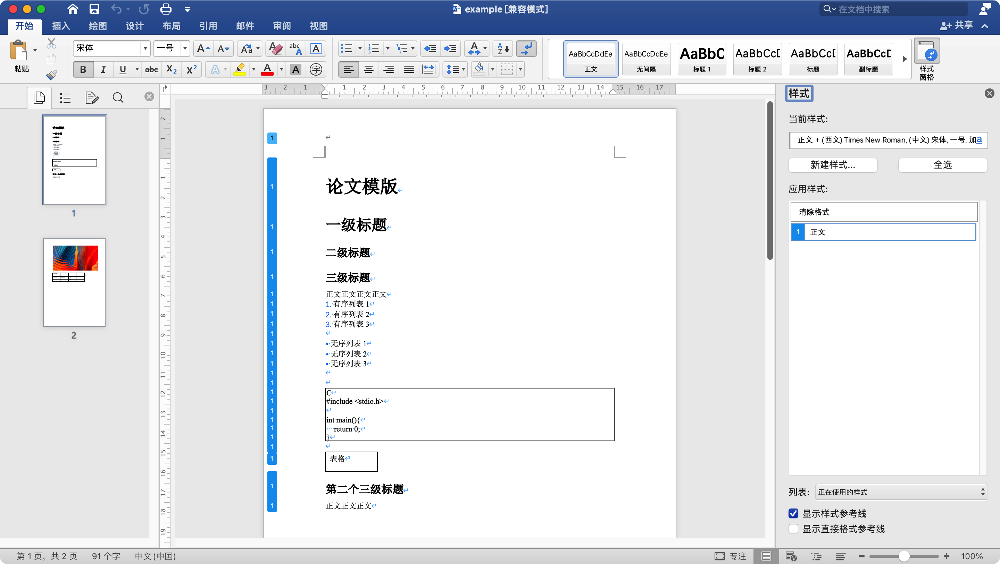
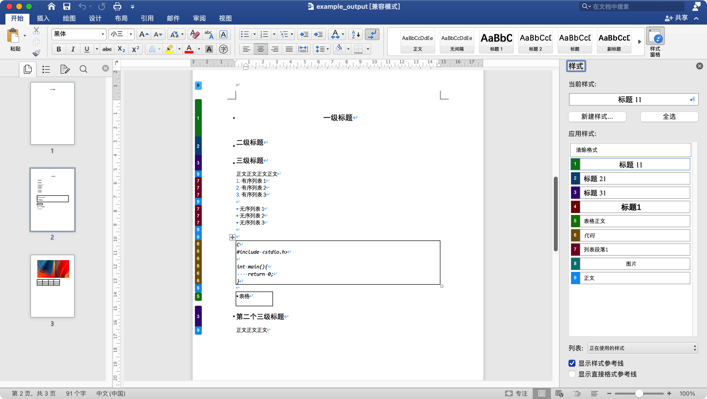

# larkdoc2docx
为飞书文档生成的docx文档添加样式


# 使用效果

## 添加前



标题和正文等内容均使用正文样式，不方便后期修改

## 添加后



为标题和正文等内容添加不同样式，方便后期修改

# 使用方法

## 安装python-docx库

原python-docx库不支持设置中文字体，我对python-docx库进行了修改，这里建议直接安装我修改后的库。

### 下载源码安装(推荐)

https://github.com/Harryqzm/python-docx

```
git clone https://github.com/Harryqzm/python-docx.git
cd python-docx
python setup.py install
```

### 使用pip安装

```
pip install python-docx
```


## 设置样式文件（可选）

本程序将根据模版文件的字体和段落格式来设置样式，读取的模版文件路径为file/template.docx。

作者提供了模版文件，用户和根据自己的需要自行修改

# 快速使用

```
python main.py <larkdoc_filename.docx>
```

示例:

```
python main.py file/example.docx
```

# 问题和建议

如果您在使用过程中遇到任何问题，欢迎前往[Issue](https://github.com/Harryqzm/larkdoc2docx/issues)提问

